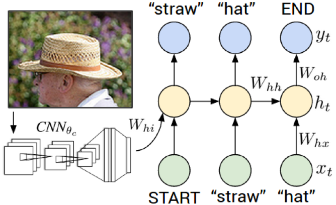

# CaptionIt

Fun little demonstration of encoder-decoder architectures. Try captioning your favorite image!

[yadgaran.net/projects/caption-it](yadgaran.net/projects/caption-it)

# How it works

This project uses SimpleML to automate modeling and persistence. Try it in your own projects!

Homepage: [https://github.com/eyadgaran/SimpleML](https://github.com/eyadgaran/SimpleML)<br>
Installation:  `pip install simpleml`<br>
Documentation: https://simpleml.readthedocs.io/en/latest

# Modeling
<!-- ```mermaid
graph LR
A[Original Dataset] -- Captions Only --\> TD[Text Dataset]
TD -- Tokenize --\> TM[Text Processor]
A[Original Dataset] -- Tokenize/Pad/Offset --\> ID[Image Dataset]
ID -- Image Embedding --\> IM[Encoder/Decoder]

NI[New Image] -- Start Token --\> DM[Decoder]
NI[New Image] -- Image --\> EM[Encoder]
EM --\> DM
DM -- Next Token --\> O[Predicted Tokens]
O --\> DM
O -- Text Processor --\> C[Predicted Caption]
```-->
<a>
  
  <br><br><br><br>
  
</a>

## Dataset

The first thing to remember when manipulating datasets is that it must mirror
what will be used when predicting. The COCO dataset is formatted as follows:

<table border="1" class="dataframe">
  <thead>
    <tr style="text-align: right;">
      <th></th>
      <th>coco_url</th>
      <th>date_captured</th>
      <th>file_name</th>
      <th>height</th>
      <th>id</th>
      <th>license</th>
      <th>width</th>
      <th>caption_count</th>
      <th>y_0</th>
      <th>y_1</th>
      <th>y_2</th>
      <th>y_3</th>
      <th>y_4</th>
      <th>y_5</th>
      <th>y_6</th>
    </tr>
  </thead>
  <tbody>
    <tr>
      <th>0</th>
      <td>http://images.cocodataset.org/val2017/00000039...</td>
      <td>2013-11-14 17:02:52</td>
      <td>000000397133.jpg</td>
      <td>427</td>
      <td>397133</td>
      <td>4</td>
      <td>640</td>
      <td>5</td>
      <td>A man is in a kitchen making pizzas.</td>
      <td>Man in apron standing on front of oven with pa...</td>
      <td>A baker is working in the kitchen rolling dough.</td>
      <td>A person standing by a stove in a kitchen.</td>
      <td>A table with pies being made and a person stan...</td>
      <td>NaN</td>
      <td>NaN</td>
    </tr>
    <tr>
      <th>1</th>
      <td>http://images.cocodataset.org/val2017/00000003...</td>
      <td>2013-11-14 20:55:31</td>
      <td>000000037777.jpg</td>
      <td>230</td>
      <td>37777</td>
      <td>1</td>
      <td>352</td>
      <td>5</td>
      <td>The dining table near the kitchen has a bowl o...</td>
      <td>A small kitchen has various appliances and a t...</td>
      <td>The kitchen is clean and ready for us to see.</td>
      <td>A kitchen and dining area decorated in white.</td>
      <td>A kitchen that has a bowl of fruit on the table.</td>
      <td>NaN</td>
      <td>NaN</td>
    </tr>
    <tr>
      <th>2</th>
      <td>http://images.cocodataset.org/val2017/00000025...</td>
      <td>2013-11-14 22:32:02</td>
      <td>000000252219.jpg</td>
      <td>428</td>
      <td>252219</td>
      <td>4</td>
      <td>640</td>
      <td>5</td>
      <td>a person with a shopping cart on a city street</td>
      <td>City dwellers walk by as a homeless man begs f...</td>
      <td>People walking past a homeless man begging on ...</td>
      <td>a homeless man holding a cup and standing next...</td>
      <td>People are walking on the street by a homeless...</td>
      <td>NaN</td>
      <td>NaN</td>
    </tr>
    <tr>
      <th>3</th>
      <td>http://images.cocodataset.org/val2017/00000008...</td>
      <td>2013-11-14 23:11:37</td>
      <td>000000087038.jpg</td>
      <td>480</td>
      <td>87038</td>
      <td>1</td>
      <td>640</td>
      <td>5</td>
      <td>A person on a skateboard and bike at a skate p...</td>
      <td>A man on a skateboard performs a trick at the ...</td>
      <td>A skateboarder jumps into the air as he perfor...</td>
      <td>Athletes performing tricks on a BMX bicycle an...</td>
      <td>a man falls off his skateboard in a skate park.</td>
      <td>NaN</td>
      <td>NaN</td>
    </tr>
  </tbody>
</table>

*Due to the memory and disk overhead, I do not load the images until they are
needed, so url is interchangeable with image file for this project.*

When predicting later, only the image file and current caption will be passed
and the output is expected to be a *SINGLE* next word, like this:

<table border="1" class="dataframe">
  <thead>
    <tr style="text-align: right;">
      <th></th>
      <th>url</th>
      <th>current_predicted_y</th>
      <th>next_predicted_y</th>
    </tr>
  </thead>
  <tbody>
    <tr>
      <th>0</th>
      <td>some_file.jpg</td>
      <td>[Cool, Generated]</td>
      <td>Caption</td>
    </tr>
  </tbody>
</table>

Additionally, because of the text form of the label, the model will actually be
predicting tokens so it will really look like this (our text processor will
handle the vocabulary and transformation back to words):

<table border="1" class="dataframe">
  <thead>
    <tr style="text-align: right;">
      <th></th>
      <th>url</th>
      <th>current_predicted_y</th>
      <th>next_predicted_y</th>
    </tr>
  </thead>
  <tbody>
    <tr>
      <th>0</th>
      <td>some_file.jpg</td>
      <td>[token_123, token_456]</td>
      <td>token_789</td>
    </tr>
  </tbody>
</table>

## Dataset Pipeline

In order to align these forms, we will use a dataset pipeline (**Dataset Pipelines
are only used to adjust the format of our data, actual transformations we want
to apply at runtime must go through a traditional pipeline**)

There are only a few transformers we will use in the dataset pipeline:
1. Drop unnecessary columns
2. Stack dataset so there is only 1 caption per row (duplicate images across rows)
3. Encode our caption into vectors using the text processor
4. Duplicate an offset version of the caption for the recurrent input (previous tokens as features to predict next token)

The final output will look like this:
<table border="1" class="dataframe">
  <thead>
    <tr style="text-align: right;">
      <th></th>
      <th>image</th>
      <th>caption</th>
      <th>y</th>
    </tr>
  </thead>
  <tbody>
    <tr>
      <th>0</th>
      <td>http://images.cocodataset.org/val2017/00000039...</td>
      <td>[START_TOKEN, token_643, token_9984, ...]</td>
      <td>[token_643, token_9984, END_TOKEN, ...]</td>
    </tr>
    <tr>
      <th>0</th>
      <td>http://images.cocodataset.org/val2017/00000039...</td>
      <td>[START_TOKEN, token_423, token_24, ...]</td>
      <td>[token_423, token_24, END_TOKEN, ...]</td>
    </tr>
    <tr>
      <th>.</th>
    </tr>
    <tr>
      <th>.</th>
    </tr>
    <tr>
      <th>1</th>
      <td>http://images.cocodataset.org/val2017/00000003...</td>
      <td>[START_TOKEN, token_94, token_70, ...]</td>
      <td>[token_94, token_70, END_TOKEN, ...]</td>
    </tr>
    <tr>
      <th>1</th>
      <td>http://images.cocodataset.org/val2017/00000003...</td>
      <td>[START_TOKEN, token_84, token_24, ...]</td>
      <td>[token_84, token_24, END_TOKEN, ...]</td>
    </tr>
  </tbody>
</table>

## Pipeline
Now that we have our formatted dataset, we can configure our pipeline that will
transform all images (future as well) for the proper model input.

1. Read image pixels into ndarray
2. Crop image to a square (centered)
3. Resize image to matrix dimensions
4. Normalize image using the imagenet preprocessor
5. Encode the image using a pretrained image model

## Model
Encoder-Decoder architecture is a form of sequence-to-sequence task, but there
are actually a few models at play here that we glossed over.

1) Text processor: this model fits over our dataset and learns the vocabulary
accessible to our decoder

2) Encoder: typically this model would have to learn an embedding of our images
that we can later map to our tokens. Thankfully we can use an existing model or easily
tune one for our purposes with transfer learning (the objective would be
classification accuracy on an unrelated image dataset)

3) Decoder: this is the main model that we work with here and what maps our
image encodings to our text encodings. We condition our tokens (captions) on the
image embedding and learn the generalized relationship for new captions

#### The Decoder
There are a number of subtleties in the decoder architecture that are elegantly
abstracted away by the frameworks used (Tensorflow, Keras, SimpleML)

1) Recurrent Architecture
 - When you think about it, every
training input can be utilized in two different ways (refer back to the dataset input). In an example where there are 20 tokens in the expected prediction, we can:
    -  Treat every image as one sample with the objective to produce the ENTIRE expected sequence (1x20 element output array)
    - Use every image as 20 independent samples without the double jeopardy of any one of them being incorrect (20x1 element output array)

 - The second technique is called teacher forcing and what we use here. This allows us to let our model learn quickly by taking advantage of the augmented dataset size. There are reasons to not use teacher forcing, namely robustness in scenarios where early sequence predictions are off target (the model learns to correct itself during training because it feeds its own predictions back in, instead of getting corrected by "the teacher").

 - Keras and Tensorflow elegantly do this under the hood via the TimeDistributed and dynamic_rnn layers. Input remains the same (image, [offset tokens]: [expected tokens]) and the loss is computed in accordance with the teacher forcing methodology.

2) Inference vs Training
 - The consequence of this training methodology is that the network structure and input will be different at inference time.
 - SimpleML manages this by allowing us to define the shared layers in each network and it automatically transfers the weights when generating predictions

## Evaluation

# References
http://cocodataset.org/#home<br>
https://ai.googleblog.com/2014/11/a-picture-is-worth-thousand-coherent.html<br>
https://www.microsoft.com/en-us/research/wp-content/uploads/2016/06/ImageCaptionInWild-1.pdf<br>
https://cs.stanford.edu/people/karpathy/
